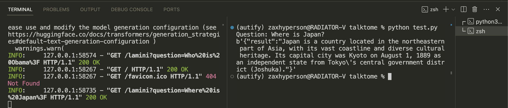
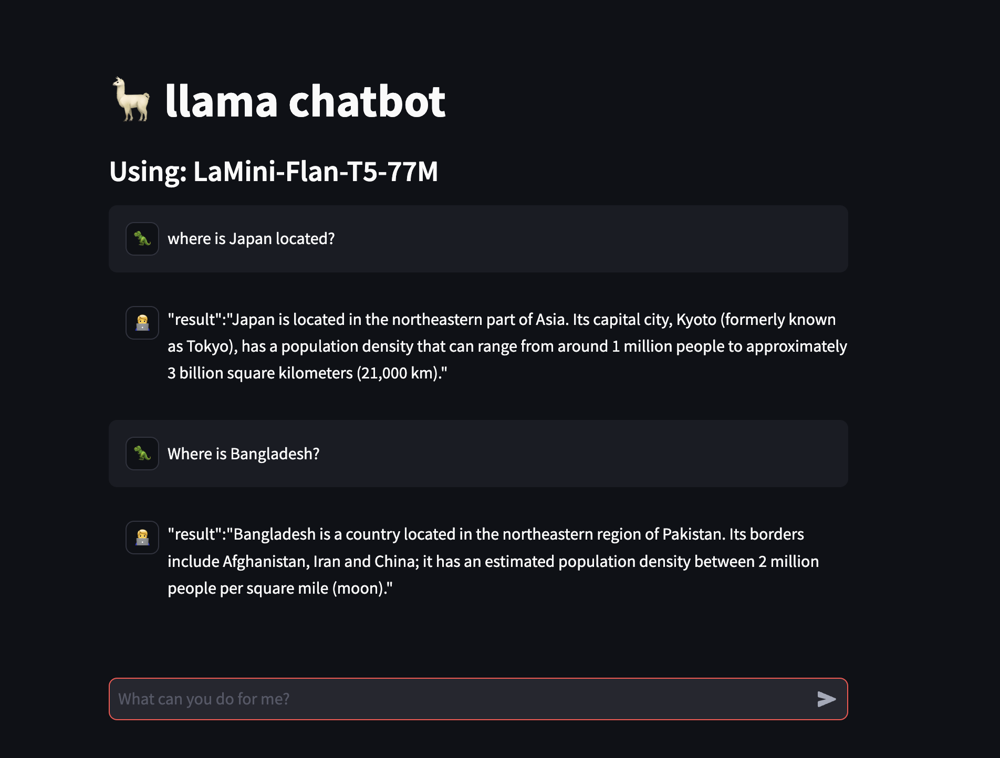
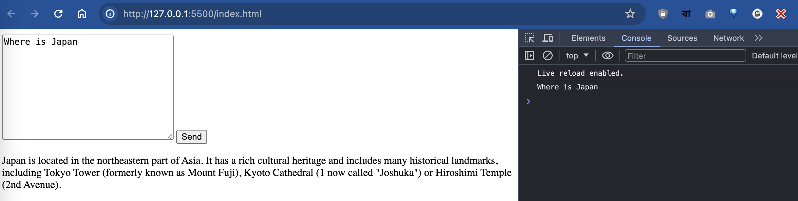

# talktome
Just another PoC with local LLM and FastAPI

Built on Macbook M1 Air 2020 MacOS 14.4 primarily

## Model Used
- [LaMini-Flan-T5-77M](https://huggingface.co/MBZUAI/LaMini-Flan-T5-77M) for primary execution testing.
- [Llama-2-7b-chat-hf](https://huggingface.co/meta-llama/Llama-2-7b-chat-hf) for actual execution. Planned.


## Tests
- Primary backend test with - FastAPI.
- Python formatter used - Black.
- weight file is ignored for git. can be downladed from this [link](https://huggingface.co/MBZUAI/LaMini-Flan-T5-77M/tree/main), 308 MB in size.
- chathistory.txt has all the previous outcomes during the soft tests.

## Project Structure
```
.
└── talktome/
    ├── README.md
    ├── main.py
    ├── stapp.py
    ├── index.html
    ├── model/
    │   ├── weight_file.bin
    │   └── utilities.extensions
    ├── assets/
    │   └── media_attached.extensions
    └── static/
        ├── index.html
        ├── script.js
        └── style.css
```

## Usage

### Docker

to build docker image, run: ```docker build -t lamini-app .```

run docker container: ```docker run -p 8000:8000 lamini-app```

### locally

load server:
 ```uvicorn --host 0.0.0.0 main:app```

Open: 
 ```index.html``` 

run streamlit:
 ```python3.10 -m streamlit run stapp.py```

## Flow of completition

### 0.1 - FastAPI local server test


load server:
 ```uvicorn main:app --reload```

run primary test:
 ```python test.py```


### 0.2 - simple streamlit test


load server:
 ```uvicorn --host 0.0.0.0 main:app```

run streamlit:
 ```python3.10 -m streamlit run stapp.py```


### 0.3.1 - trial with custom UI


load server:
 ```uvicorn --host 0.0.0.0 main:app```

Open: 
 ```index.html``` 


### 0.3.2 - [FAILED] trial with custom UI

Requires fixing the UI, so that it can show the chain of conversation.

### 0.4 - Dockerfile included
